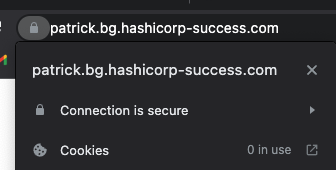

# Let's Encrypt

This README describes how to create valid certificates to use for websites using Let's Encrypt. Using Let's Encrypt enables you to create free certificates. 

You will use a vagrant box to have a server on which to create the certificates and test them. 

# Prerequisites

Vagrant [See documentation](https://www.vagrantup.com/docs/installation)  
Virtualbox [See documentation](https://www.virtualbox.org/wiki/Downloads)


# Create Let's Encrypt certificates

- in AWS create a valid DNS record in route53 
```
patrick.bg.hashicorp-success.com	A	Simple	-	
192.168.56.33
```
- test it
```
nslookup patrick.bg.hashicorp-success.com

Server:		192.168.0.1
Address:	192.168.0.1#53

Non-authoritative answer:
Name:	patrick.bg.hashicorp-success.com
Address: 192.168.56.33
```

- create a vagrantfile to create a test server with nginx
```
vagrant up
```

## Vagrant machine

- login to the machine
```
vagrant ssh
```
- install certbot
```
# install certbot if not installed
sudo apt-get update
sudo apt-get install -y certbot
```
- create a certificate to use for the website
```
# generate a certificate for our domain
# use manual challenge, and we will create a dns entry manually
certbot -d patrick.bg.hashicorp-success.com --manual --preferred-challenges dns certonly
```
```
sudo certbot -d patrick.bg.hashicorp-success.com --manual --preferred-challenges dns certonly
Saving debug log to /var/log/letsencrypt/letsencrypt.log
Plugins selected: Authenticator manual, Installer None
Enter email address (used for urgent renewal and security notices) (Enter 'c' to
cancel): patrick.munne@hashicorp.com

- - - - - - - - - - - - - - - - - - - - - - - - - - - - - - - - - - - - - - - -
Please read the Terms of Service at
https://letsencrypt.org/documents/LE-SA-v1.2-November-15-2017.pdf. You must
agree in order to register with the ACME server at
https://acme-v02.api.letsencrypt.org/directory
- - - - - - - - - - - - - - - - - - - - - - - - - - - - - - - - - - - - - - - -
(A)gree/(C)ancel: A

- - - - - - - - - - - - - - - - - - - - - - - - - - - - - - - - - - - - - - - -
Would you be willing to share your email address with the Electronic Frontier
Foundation, a founding partner of the Let's Encrypt project and the non-profit
organization that develops Certbot? We'd like to send you email about our work
encrypting the web, EFF news, campaigns, and ways to support digital freedom.
- - - - - - - - - - - - - - - - - - - - - - - - - - - - - - - - - - - - - - - -
(Y)es/(N)o: N
Obtaining a new certificate
Performing the following challenges:
dns-01 challenge for patrick.bg.hashicorp-success.com

- - - - - - - - - - - - - - - - - - - - - - - - - - - - - - - - - - - - - - - -
NOTE: The IP of this machine will be publicly logged as having requested this
certificate. If you're running certbot in manual mode on a machine that is not
your server, please ensure you're okay with that.

Are you OK with your IP being logged?
- - - - - - - - - - - - - - - - - - - - - - - - - - - - - - - - - - - - - - - -
(Y)es/(N)o: Y

- - - - - - - - - - - - - - - - - - - - - - - - - - - - - - - - - - - - - - - -
Please deploy a DNS TXT record under the name
_acme-challenge.patrick.bg.hashicorp-success.com with the following value:

fXqLH5VbdFVDBalhCtyV3_f7Co7N9HrlDE0phDZY4AQ

Before continuing, verify the record is deployed.
- - - - - - - - - - - - - - - - - - - - - - - - - - - - - - - - - - - - - - - -
Press Enter to Continue
```
- create this DNS TXT record in aws route53
```
_acme-challenge.patrick.bg.hashicorp-success.com

```
- Check in a different terminal
```
dig TXT _acme-challenge.patrick.bg.hashicorp-success.com

; <<>> DiG 9.10.6 <<>> TXT _acme-challenge.patrick.bg.hashicorp-success.com
;; global options: +cmd
;; Got answer:
;; ->>HEADER<<- opcode: QUERY, status: NOERROR, id: 8576
;; flags: qr rd ra; QUERY: 1, ANSWER: 1, AUTHORITY: 0, ADDITIONAL: 1

;; OPT PSEUDOSECTION:
; EDNS: version: 0, flags:; udp: 4096
;; QUESTION SECTION:
;_acme-challenge.patrick.bg.hashicorp-success.com. IN TXT

;; ANSWER SECTION:
_acme-challenge.patrick.bg.hashicorp-success.com. 300 IN TXT "fXqLH5VbdFVDBalhCtyV3_f7Co7N9HrlDE0phDZY4AQ"

;; Query time: 25 msec
;; SERVER: 192.168.0.1#53(192.168.0.1)
;; WHEN: Mon Nov 29 10:58:34 CET 2021
;; MSG SIZE  rcvd: 133
```

- continue by pressing ENTER
```
Waiting for verification...
Cleaning up challenges

IMPORTANT NOTES:
 - Congratulations! Your certificate and chain have been saved at:
   /etc/letsencrypt/live/patrick.bg.hashicorp-success.com/fullchain.pem
   Your key file has been saved at:
   /etc/letsencrypt/live/patrick.bg.hashicorp-success.com/privkey.pem
   Your cert will expire on 2022-02-27. To obtain a new or tweaked
   version of this certificate in the future, simply run certbot
   again. To non-interactively renew *all* of your certificates, run
   "certbot renew"
 - Your account credentials have been saved in your Certbot
   configuration directory at /etc/letsencrypt. You should make a
   secure backup of this folder now. This configuration directory will
   also contain certificates and private keys obtained by Certbot so
   making regular backups of this folder is ideal.
 - If you like Certbot, please consider supporting our work by:

   Donating to ISRG / Let's Encrypt:   https://letsencrypt.org/donate
   Donating to EFF:                    https://eff.org/donate-le
```
- Backup the certificate files
```
cp -apL /etc/letsencrypt/live/patrick.bg.hashicorp-success.com /vagrant
```

## Test the NGINX configuration with the certificates
- install nginx
```
sudo apt-get install -y nginx
```
- configure nginx with following configuration
```
vi /etc/nginx/sites-enabled/default 
```
```
# Default server configuration
server {
	listen 80 default_server;
	listen [::]:80 default_server;

	# SSL configuration
	#
	listen 443 ssl default_server;
	listen [::]:443 ssl default_server;

	ssl_certificate /etc/letsencrypt/live/patrick.bg.hashicorp-success.com/fullchain.pem; # managed by Certbot
	ssl_certificate_key /etc/letsencrypt/live/patrick.bg.hashicorp-success.com/privkey.pem; # managed by Certbot

	root /var/www/html;
	index index.html index.htm index.nginx-debian.html;
	server_name _;

	location / {
		# First attempt to serve request as file, then
		# as directory, then fall back to displaying a 404.
		try_files $uri $uri/ =404;
	}
}
```
- restart the nginx server
```
service nginx restart
```
- in a web browser you should now see a valid environment  
  
